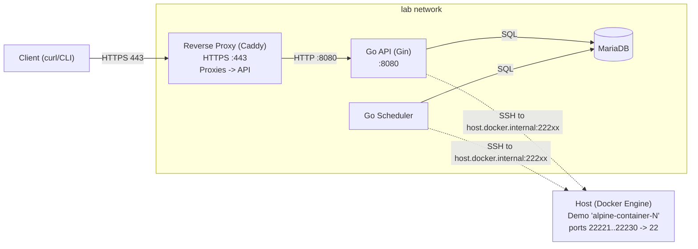

# Container/Machine Manager (Go API + Scheduler)

A Docker-first, infrastructure-as-code system to manage a pool of machines/containers.

- Go REST API (Gin) for users, machines, and reservations
- Go Scheduler for reservation cleanup
- MariaDB for persistence
- Ansible playbooks to provision/unprovision demo “machines”
- Caddy reverse proxy (TLS termination) in front of the API
- Justfile and helper targets for common workflows

---

## Table of Contents
- [Architecture](#architecture)
- [Getting Started](#getting-started)
- [Authentication](#authentication)
- [API Endpoints](#api-endpoints)
- [Configuration](#configuration)
- [Debug](#debugging-ansible-output)

---

## Architecture

All services run on the same Docker network (lab). The reverse proxy terminates TLS and proxies to the Go API. The scheduler performs background maintenance (e.g., expiring reservations). MariaDB stores users, machines, and reservations. Demo “machines” are provisioned as Docker containers with SSH exposed on host ports; the API/Scheduler reach them via host.docker.internal.



---

## Getting Started

- Provision demo containers (count/password are optional; defaults shown):
```bash
just provision                  # defaults: 10 containers, password "test"
# or:
just provision 25 mypass
```

- Bring up the stack:
```bash
just docker-up
```

- Follow logs:
```bash
just logs
```

- Tear down:
```bash
just clean
```

Open the API via the reverse proxy at:
- https://localhost

Use -k with curl locally (self-signed cert in dev via Caddy).

---

## Authentication

- POST /auth/login issues a JWT. Include it as `Authorization: Bearer <token>` for protected endpoints.

Seeded admin (dev defaults; set via env):
- ADMIN_DEFAULT_USERNAME (default: admin)
- ADMIN_DEFAULT_PASSWORD (default: change-me)

Example: obtain a token (note `-k` for local self-signed cert)
```bash
curl -k -X POST https://localhost/auth/login \
  -H "Content-Type: application/json" \
  -d '{"username":"admin","password":"change-me"}'
# => { "access_token":"<JWT>", "token_type":"Bearer", "expires_in":3600 }
```

Check token:
```bash
TOKEN=<paste token>
curl -k -H "Authorization: Bearer $TOKEN" https://localhost/auth/me
```

Health:
```bash
curl -k https://localhost/healthz
# {"status":"ok"}
```

---

## API Endpoints

Base: https://localhost

| Method | Path                         | Auth        | Role    | Description                                |
|-------:|------------------------------|-------------|---------|--------------------------------------------|
| GET    | /healthz                     | Public      | -       | Liveness/health check                      |
| POST   | /auth/login                  | Public      | -       | Obtain JWT access token                    |
| GET    | /auth/me                     | Bearer JWT  | Any     | Return current user info                   |
| GET    | /users                       | Bearer JWT  | Admin   | List users                                 |
| POST   | /users                       | Bearer JWT  | Admin   | Create user                                |
| GET    | /users/:username             | Bearer JWT  | Admin   | Get user                                   |
| PATCH  | /users/:username             | Bearer JWT  | Admin   | Update user                                |
| DELETE | /users/:username             | Bearer JWT  | Admin   | Delete user                                |
| GET    | /machines                    | Bearer JWT  | Any     | List machines                              |
| GET    | /machines/:name              | Bearer JWT  | Any     | Get machine                                |
| POST   | /machines                    | Bearer JWT  | Admin   | Register machine                           |
| PATCH  | /machines/:name              | Bearer JWT  | Admin   | Update machine                             |
| DELETE | /machines/:name              | Bearer JWT  | Admin   | Delete machine                             |
| GET    | /reservations                | Bearer JWT  | Any     | List reservations                          |
| GET    | /reservations/:id            | Bearer JWT  | Any     | Get reservation                            |
| POST   | /reservations                | Bearer JWT  | Any     | Create reservation                         |
| DELETE | /reservations/:id            | Bearer JWT  | Any     | Cancel reservation                         |

Examples (replace $TOKEN with your JWT):

- Users (admin)
```bash
# List
curl -k -H "Authorization: Bearer $TOKEN" https://localhost/users

# Create
curl -k -X POST https://localhost/users \
  -H "Authorization: Bearer $TOKEN" \
  -H "Content-Type: application/json" \
  -d '{"username":"alice","password":"s3cret","is_admin":false}'
```

- Machines
```bash
# List
curl -k -H "Authorization: Bearer $TOKEN" https://localhost/machines

# Register (admin)
curl -k -X POST https://localhost/machines \
  -H "Authorization: Bearer $TOKEN" \
  -H "Content-Type: application/json" \
  -d '{"name":"alpine-1","host":"host.docker.internal","port":22221,"user":"root","password":"test"}'
```

- Reservations
```bash
# Create
curl -k -X POST https://localhost/reservations \
  -H "Authorization: Bearer $TOKEN" \
  -H "Content-Type: application/json" \
  -d '{"count":2,"duration_minutes":60,"reservation_password":"test"}'

# List
curl -k -H "Authorization: Bearer $TOKEN" https://localhost/reservations
```

---

## Configuration

Environment variables (key ones):

- API (Go, Gin)
  - DB_HOST, DB_PORT, DB_NAME, DB_USER, DB_PASSWORD
  - DB_CHARSET (default: utf8mb4), DB_COLLATION (default: utf8mb4_unicode_ci)
  - DB_TIMEOUT (default: 5s), DB_READ_TIMEOUT (default: 5s), DB_WRITE_TIMEOUT (default: 5s)
  - JWT_SECRET
  - ADMIN_DEFAULT_USERNAME, ADMIN_DEFAULT_PASSWORD
  - ANSIBLE_PLAYBOOK (default: /app/playbooks/create-users.yml)
  - ANSIBLE_FORKS (optional; used when invoking Ansible)

- Scheduler (Go)
  - Same DB_* variables as the API
  - SCHEDULER_INTERVAL (seconds; default: 60)
  - CLEANUP_BATCH_SIZE (default: 20)
  - ANSIBLE_FORKS (default: 5)
  - DB_LOCK_TIMEOUT (seconds; 0 = try-lock, no wait)

- Reverse proxy (Caddy)
  - Listens on 443 and proxies to the API at http://api:8080 (no path prefix)

Production: set strong secrets, use trusted certificates, and tailor timeouts/limits as needed.

## Debugging Ansible output

The API and Scheduler can emit Ansible output to the container logs for easier troubleshooting. This is controlled with the `LOG_LEVEL` environment variable. The default mode is `info` which preserves the existing (concise) logging behavior.

Available levels
- `info` (default)  
  Quiet, only error summaries — same behavior as before.
- `debug`  
  Streams Ansible stdout/stderr to the container logs (human-readable, no extra `-v` flags). The API will also log the Ansible inventory used, with `ansible_password` values redacted.
- `trace` (`trace` / `trace1`)  
  Enables `-v` for `ansible-playbook` (more verbose).
- `trace2` (`trace2` / `trace-2`)  
  Enables `-vv` for `ansible-playbook`.
- `trace3` (`trace3` / `trace-3`)  
  Enables `-vvv` for `ansible-playbook` (most verbose).
