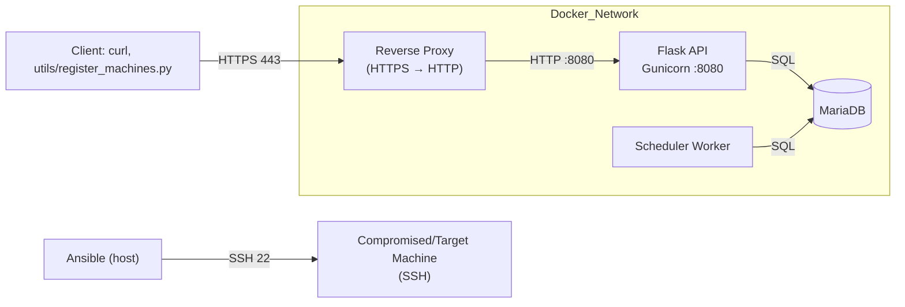

# Projet-IAC
## Container/Machine Manager API

A Docker-first, infrastructure-as-code system to manage a pool of machines/containers. It provides:
- A Flask API (served by Gunicorn) to register machines, check availability, and handle reservations
- A scheduler worker that cleans up expired reservations and performs maintenance
- MariaDB for persistence
- Ansible playbooks to provision/unprovision the pool
- A Justfile to orchestrate common workflows (run, run-dev, clean, logs)

Authentication is not implemented yet.

---

## Requirements
- Docker and Docker Compose plugin (Docker Desktop on macOS/Windows, Docker Engine on Linux)
- Ansible installed on the host (with the community.docker collection if you target Docker)
- Python 3.9+ on the host (for helper scripts via Just)
- just command runner (brew install just or cargo install just)

---

## Quick start

Run with a stable image (no hot reload):
```bash
just run
```

Run in development with hot reload (bind-mounts your src/ and uses gunicorn --reload):
```bash
just run-dev
```

Stop and clean everything (unprovision, reset DB volumes, remove venv):
```bash
just clean
```

After startup, test through the reverse proxy (self-signed cert in dev; use -k to ignore TLS verification):
```bash
curl -k https://localhost/healthz
curl -k https://localhost/available
```

In production, you should use a reverse proxy with a trusted (verified) certificate; -k is only for the local self-signed example.

---

## Commands (from Justfile)

- run: setup venv + provision + docker-up + register-machine
- run-dev: setup venv + provision + docker-up-dev + register-machine (hot reload)
- docker-up: docker compose up -d (base compose only)
- docker-up-dev: docker compose up -d with src/docker-compose.dev.override.yml
- logs / logs-dev: follow logs for api, scheduler
- docker-down / docker-down-dev: stop the stack
- docker-reset / docker-reset-dev: stop and delete volumes (fresh DB)
- provision / unprovision / reprovision: run Ansible playbooks
- register-machine: POST all entries from provision/machines.txt to the API
- clean: unprovision, reset volumes (both variants), remove venv

The Justfile uses a local Python venv to run the helper script.

---

## Architecture

High level:
- Reverse proxy: terminates TLS (self-signed in dev), exposes HTTPS on localhost, forwards to the API service
- API: Flask app served by Gunicorn on HTTP :8080 inside the Docker network; reads/writes reservations and machines in MariaDB
- Scheduler: background worker; periodically scans DB to expire reservations and perform maintenance
- DB: MariaDB service; schema initialized by the API on first run



Notes:
- Code inside containers lives at /app/src.
- In dev, src/docker-compose.dev.override.yml bind-mounts host ./src to /app/src and runs Gunicorn with --reload for the API.

---

## Configuration

Most configuration lives in src/docker-compose.yml (and the dev override). Common variables:
- DATABASE_URL: e.g., mysql+pymysql://appuser:apppass@db:3306/containers?charset=utf8mb4
- Gunicorn tuning via env (optional): WORKER_CLASS, WEB_CONCURRENCY, GTHREADS, GUNICORN_LOGLEVEL
- PRETTY_JSON=1 (optional) to pretty-print JSON responses in dev

Compose can load a .env file located in src/ for environment values.

---

## API endpoints

Base URL (through the reverse proxy): https://localhost

Use -k with curl locally because the example uses a self-signed certificate.

- GET /healthz → {"status":"ok"}
  ```bash
  curl -k https://localhost/healthz
  ```
- GET /available → current available/reserved pool status
  ```bash
  curl -k https://localhost/available
  ```
- POST /machines → register a machine
  ```bash
  curl -k -X POST -H "Content-Type: application/json" \
    -d '{"name":"alpine-1","host":"localhost","port":2221,"user":"root","password":"test"}' \
    https://localhost/machines
  ```
- GET /machines → list machines
  ```bash
  curl -k https://localhost/machines
  ```
- DELETE /machines/<name> → remove a machine
  ```bash
  curl -k -X DELETE https://localhost/machines/alpine-1
  ```
- GET /reserve → reserve N machines for a user
  - Query params: username, password, count (default 1), duration (minutes, default 60)
  ```bash
  curl -k "https://localhost/reserve?username=alice&password=test&count=2&duration=60"
  ```
- GET /release_all → release all machines and delete users
  ```bash
  curl -k "https://localhost/release_all"
  ```
- GET /reservations → list active reservations and time remaining
  ```bash
  curl -k "https://localhost/reservations"
  ```

In production, configure the reverse proxy with a trusted certificate and remove -k.

---

## Registering machines

Machines are listed in provision/machines.txt (one per line):
```
name host port user password
```

Bulk-register them:
```bash
just register-machine
```

This uses utils/register_machines.py against the API at https://localhost/machines.

---

## Development (hot reload)

Use the dev override:
```bash
just run-dev
```

Dev behavior:
- Host src/ is bind-mounted into /app/src inside api and scheduler containers.
- API runs Gunicorn with --reload; edits under src/api will trigger worker restarts automatically (watch docker-logs-dev).
- Scheduler code changes are visible via the bind mount; restart the scheduler service to apply code changes if it doesn’t self-reload.

If hot reload seems flaky on macOS bind mounts, polling is enabled via WATCHFILES_FORCE_POLLING for better reliability.

---

## Troubleshooting

- API not ready during registration:
  - Check logs: `just docker-logs` or `just docker-logs-dev`
  - Health check: `curl -k https://localhost/healthz`
- Dev override not applied:
  - Run with: `docker compose -f src/docker-compose.yml -f src/docker-compose.dev.override.yml up -d`
  - Inspect merged config: `docker compose -f src/docker-compose.yml -f src/docker-compose.dev.override.yml config`
  - Confirm the bind mount path matches /app/src in the image.
- Database reset:
  - `just docker-reset` or `just docker-reset-dev` (drops volumes)
- Provisioning issues:
  - Check Ansible output and your provision/machines.txt formatting (5 fields per line).

---

## Project layout

```
.
├─ Justfile
├─ requirements.txt                 # Host-side requirements for helper scripts
├─ provision/
│  ├─ machines.txt                  # Machines to be registered
│  ├─ provision.yml                 # Ansible provisioning
│  └─ unprovision.yml               # Ansible cleanup
├─ src/
│  ├─ docker-compose.yml            # Base stack (api, scheduler, db, reverse proxy)
│  ├─ docker-compose.dev.override.yml  # Dev override: bind mounts + --reload
│  ├─ api/
│  │  ├─ Dockerfile                 # API image (copies code to /app/src/api)
│  │  └─ gunicorn.conf.py
│  ├─ scheduler/
│  │  └─ Dockerfile                 # Scheduler image
│  ├─ common/                       # Shared modules (DB init, wait_for_db, etc.)
│  └─ reverse-proxy/                # Reverse proxy config (self-signed cert in dev)
└─ utils/
   └─ register_machines.py          # Bulk registration helper
```

---
